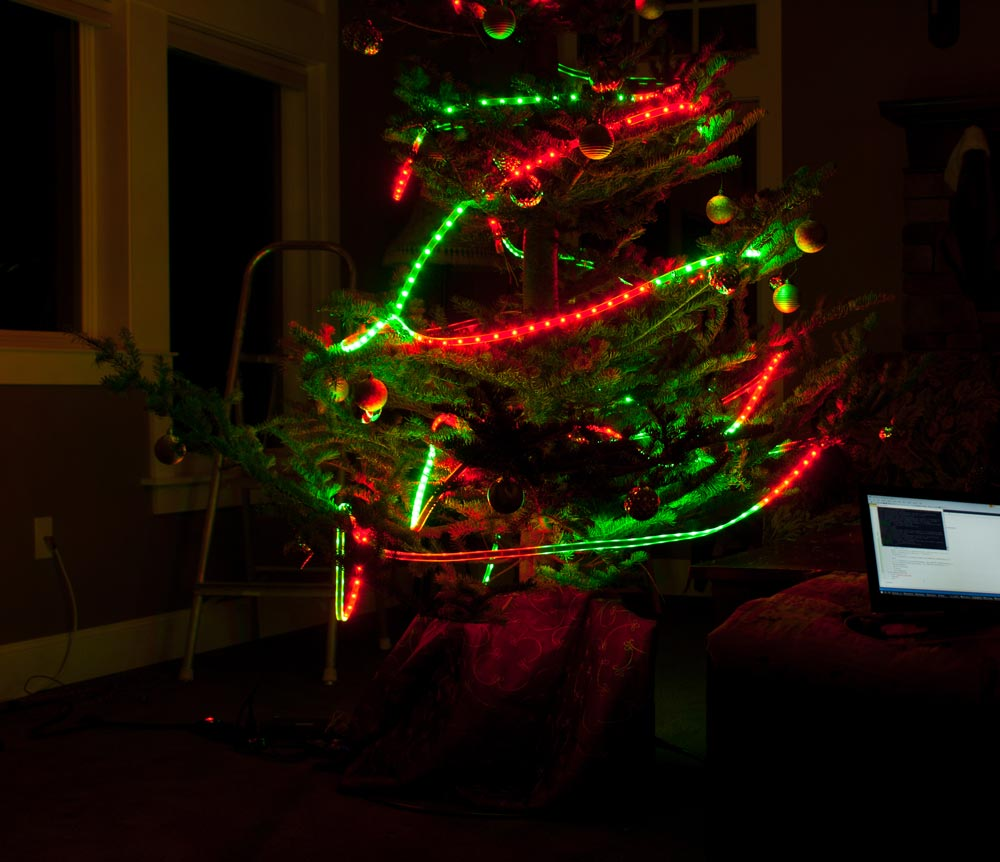
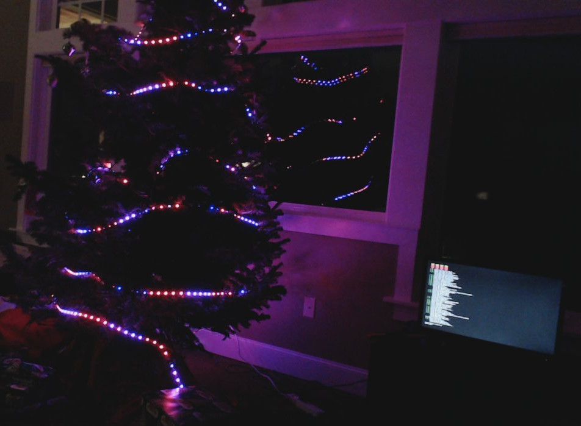
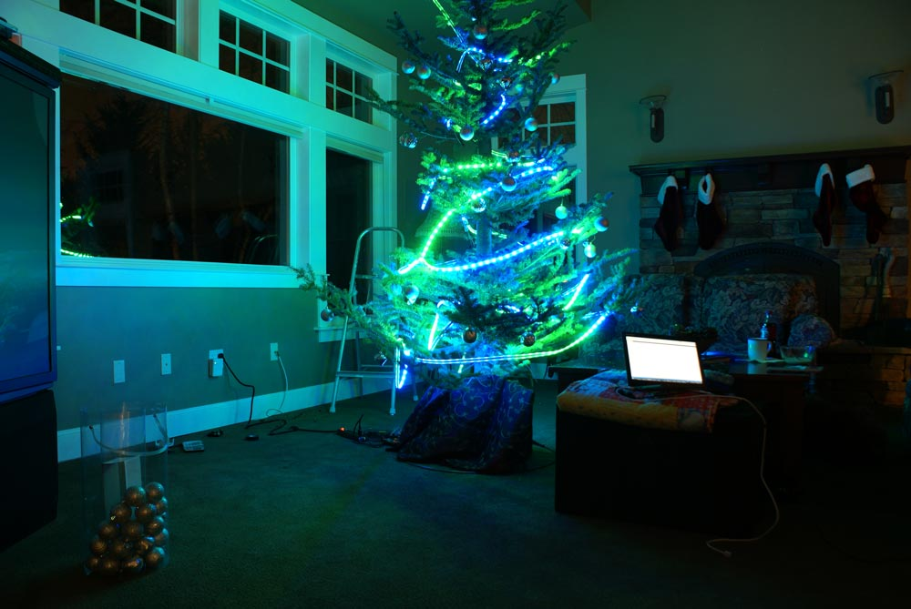

# Internet-Xmas-Tree
Web controlled animated Christmas tree lights using a Raspberry Pi and Python. In use since 2015.

**Farnsworth:** What-mas?

**Fry:** Christmas. You know? X-M-A-S.

**Leela:** Oh, you mean Xmas. You must be using an archaic pronunciation. Like when you say "ask" instead of "aks".

# What!?

In 2015 we replaced our traditional Xmas tree lights with WS2812 Neopixel LED 
strips. These strips are RGB and individually addressable, with one shared 
data line. We use 600 LEDs across 15 meters of the LED strip, which in total 
cost about $100 on sites like AliExpress or Banggood. With this many LEDs, updating isn't instant, but is quick enough to be nearly seizure-inducing.

This project has gone through multiple iterations, typically being almost 
completely rewritten each year (as I re-visit the project and find 
more flaws, or learn how to do things better).

Many parts of this project can be considered a hack, but in the interest of
getting this done I don't really care.

# How!?

I'm using Python with Flask to run two scripts.

One script handles driving
the LEDs, by setting each pixel's color and updating the strip as fast
as possible. Parameters like the pattern and colors are read from a JSON
file, which is constantly monitored for updates.

The other script runs a Flask server (for now just using the
development server) which host a static page and some API endpoints.
The index page has a form which lets users set their colors, patterns, and other parameters, which is `POST`ed to an endpoint.
Changes to the state are written to the JSON file used by the first script.
As of 2018, this index page will also grab a still image from the webcam, and update it every 10 seconds.

I'm using a cheap USB webcam to take 720p images. The monitor was nearby
in case of last-minute debugging.

Both of these scripts are set to start on bootup using systemctl scripts.

## Areas for Improvement

As stated earlier, many parts of this projects are somewhat hacked together,
and in further iterations I'd like to continue to improve the project.

- The power supply sometimes dips below the warning threshold for the Pi,
which triggers undervoltage warnings. These warnings have been disabled for now. I'm aware that this risks damaging the Pi and/or SD card, but it's good
enough for now.

- A single power supply drives both the Pi and the LEDs. I think this should
be isolated in the future.

- There is a significant voltage drop between the start and end of the LED
strips, and I do not evenly power the strips. This could be solved with
better wiring.

- The web interface could use improvement, especially on mobile.

- A Discord and/or Twitter interface of some kind would be fun. (Idea: 
tweet a color to add it to the strand.)

- Reacting to music would be fun.

# Pictures

